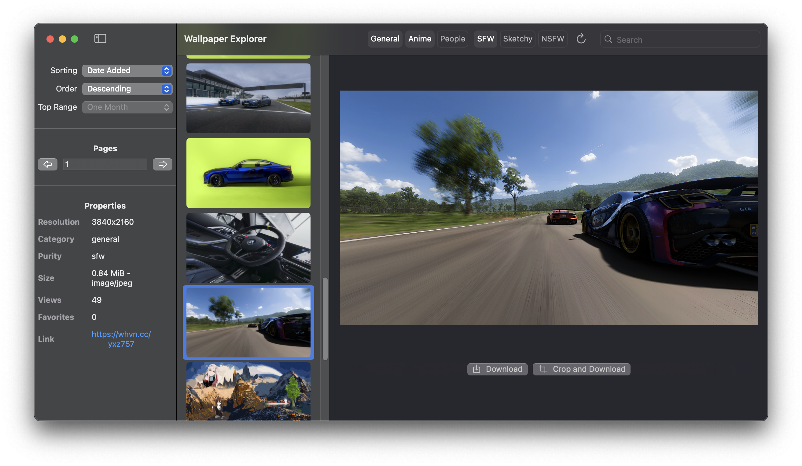

# Wallpaper Explorer

A SwiftUI application for browsing and downloading wallpapers from [Wallhaven](https://wallhaven.cc) using their [API](https://wallhaven.cc/help/api). Available for both macOS and iOS.

## Features

- Browse wallpapers
- Search by keywords
- Filter by categories (General, Anime, People)
- Filter by purity levels (SFW, Sketchy, NSFW[requires API key])
- Sort wallpapers by:
  - Date Added
  - Relevance 
  - Random
  - Views
  - Favorites
  - Toplist
- View wallpaper details including:
  - Resolution
  - Category
  - File size
  - Views/Favorites
  - Original source link
- Download wallpapers in full quality
- Data saving options for preview images

## Screenshots



## Requirements

- macOS 14.2+ or iOS 17.2+
- Xcode 15.2+
- Swift 5.0+
- Optional: [Wallhaven API key](https://wallhaven.cc/settings/account) for additional features

## Installation

1. Clone the repository:
```bash
git clone https://github.com/Enoch02/Wallpaper-Explorer.git
```
2. Open Wallpaper Explorer.xcodeproj in Xcode

3. Select the appropriate target (Wallpaper Explorer for macOS or Wallpaper Explorer Mobile for iOS)

4. Build and run the project